

# Transferring the driveshaft inertia to the grid via the DC-link in MV drive systems -- *Addendum*
### Catalin Arghir, Pieder Joerg, Silvia Mastellone

---

This archive contains the complete experimental results of the article [[1](#references)] in preparation for submission to IEEE Transactions on Control Systems Technology.

### A. Phase jump test
We first set the load to $-0.5p.u.$, amounting to 2.93 MW of negative (generating) load. We compare side-by-side the response of the two control approaches to a 60-degree phase angle shift of the infinite bus $v_{grid}$. The stiff grid case is presented in Fig. A1 and the weak case in Fig. A2.

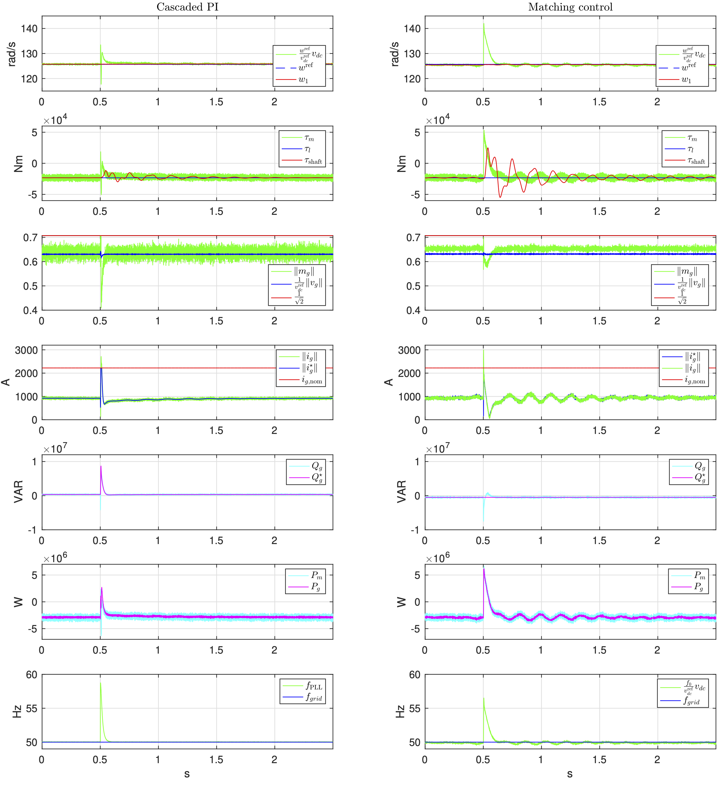
*Fig. A1: Grid angle phase shift of 60 degrees, stiff grid response. We see that both the PLL and the matching voltage respond in a well damped manner. However, the matching control voltage has a larger excursion than the cascaded PI's $v_{dc}$ which incurs a larger response from the coupling control on the mechanical side and excites the TNF, as seen in the inner-shaft torque $\tau_\textit{shaft}$.*
[Download PDF](fig/Stiff_grid_angle.pdf)

 

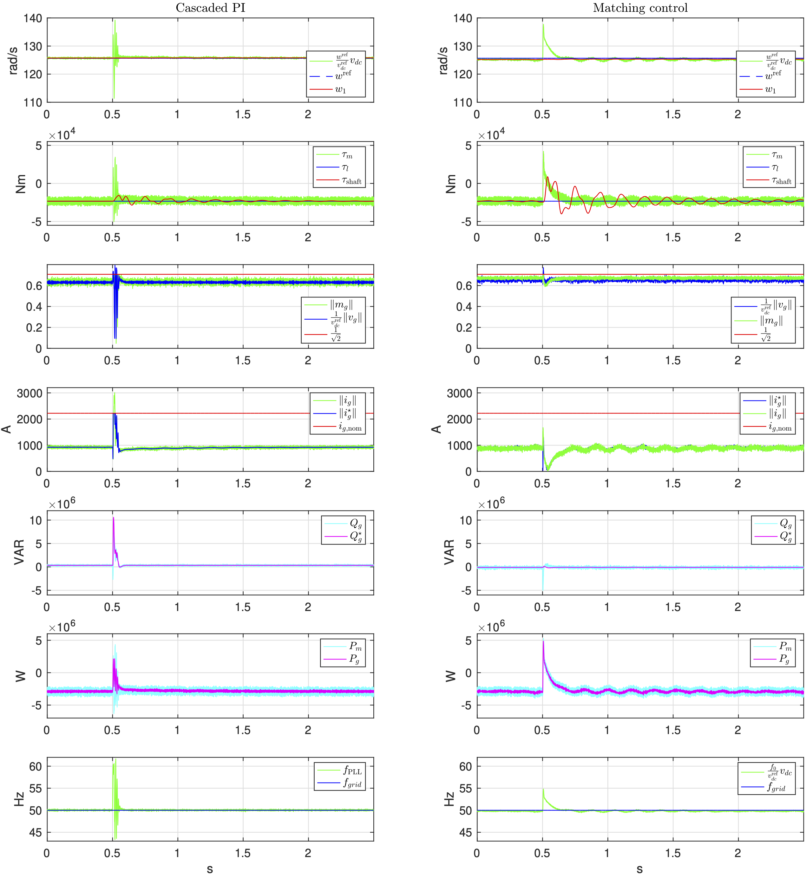  
*Fig. A2: Grid angle phase shift of 60 degrees, weak grid response. We see that the PLL has an underdamped response and cannot stabilize the AC voltage as well as the matching control, although it may be improved by tuning. This scenario shows the strength of the SM matching approach - ride-through without reaching the current limit.*
[Download PDF](fig/Weak_grid_angle.pdf)

 

### B. Three-phase drop test
We then compare the response to a 5 second short-circuit of the infinite bus $v_{grid}$ at $-0.5p.u.$ mechanical load. The stiff and weak grid cases are presented in Fig. B1 and Fig. B2, respectively.

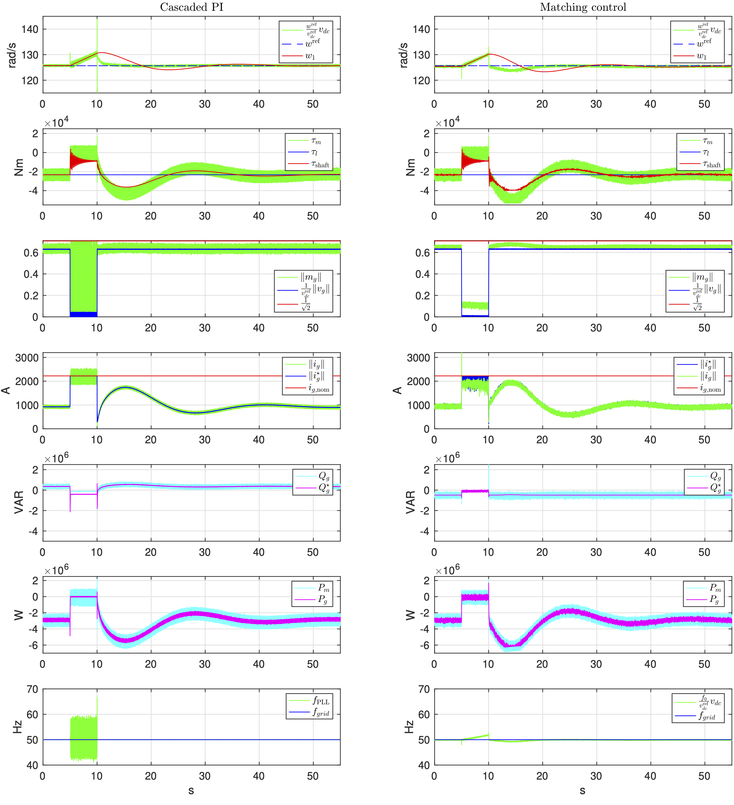
*Fig. B1: Three-phase drop, stiff grid response. We see that the PCC drops to zero amplitude due to the low grid impedance. During this time the motor torque actually drops to zero preventing the DC-link to overcharge. This effect is simply the result of the elastic coupling that is enabled through the speed control and is beneficial. On the other hand, the reactive power is driven to zero due to the fact that the current magnitude saturates which forces the projection $\Pi_\mathcal{Q}$ to render zero reactive power demand. In fact, in the stiff grid situation the AC voltage regulator has very little effect throughout the tests.*
[Download PDF](fig/Stiff_3phdrop.pdf)

 

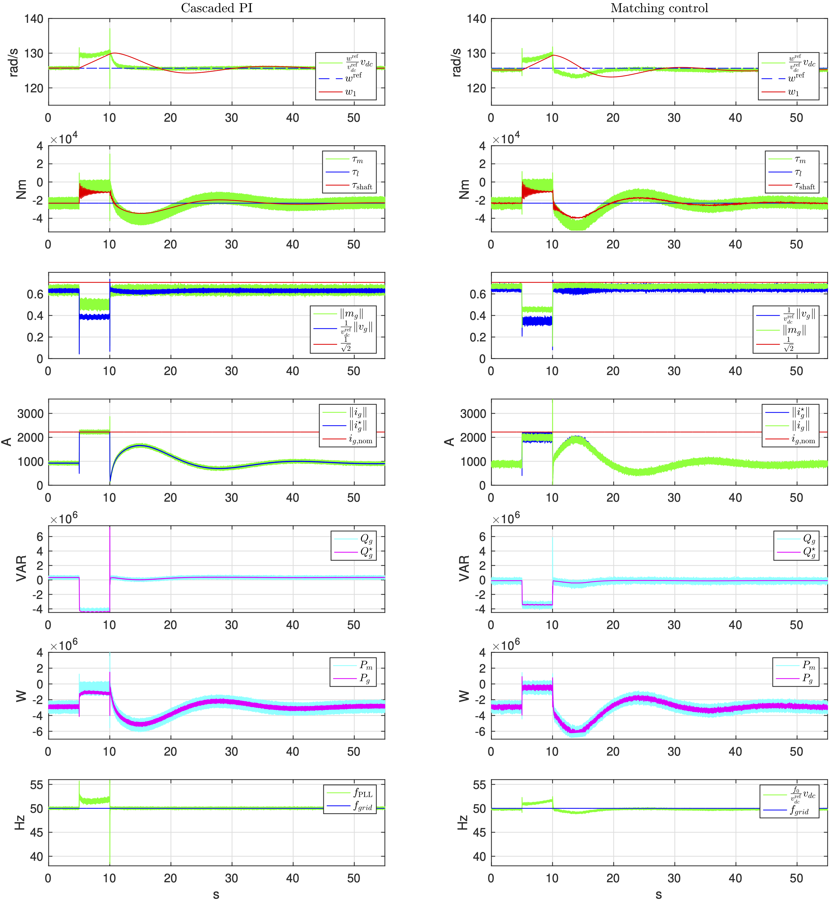  
*Fig. B2: Three-phase drop, weak grid response. Here we see that during the fault, the AC bus is sustained to the extent possible by a large capacitive current (negative $Q_g$) as a result of the AC voltage control. This feature is important for satisfying fault ride-through norms found in e.g. IEC 61400. As before, $\tau_m$ drops to zero during the fault keeping the DC-link within limits.*
[Download PDF](fig/Weak_3phdrop.pdf)

 

### C. Frequency step-up test
Here we evaluate the response to a infinite bus $v_{grid}$ frequency step of $+1Hz$ again at $-0.5p.u.$. The stiff and weak grid cases are shown in Fig. C1 and Fig. C2, respectively.

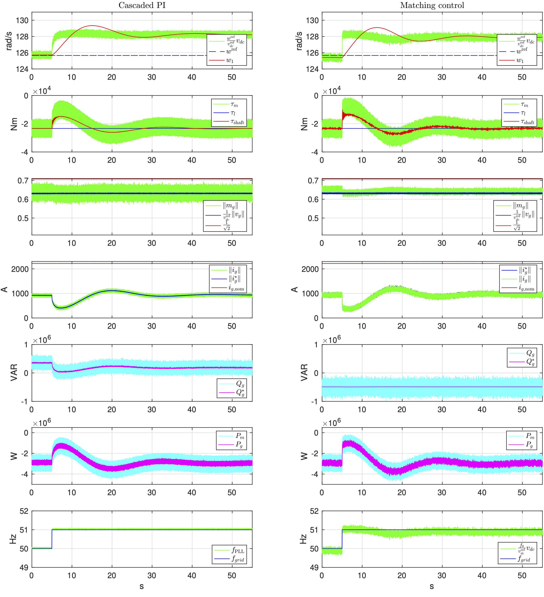
*Fig. C1: Grid frequency step up, stiff grid response. In this test, the infinite bus frequency is well tracked by both the PLL and the electronic synchronous machine. What is remarkable is how the velocity of the driveshaft tracks the DC-link causing an active power response to the frequency change, just as intended. The difference between the two approaches is noticeable in the DC-link transient, the cascaded PI is subject to the bandwidth of the DC-bus regulator while the matching approach has an instant response.*
[Download PDF](fig/Stiff_freqstep_up.pdf)

 

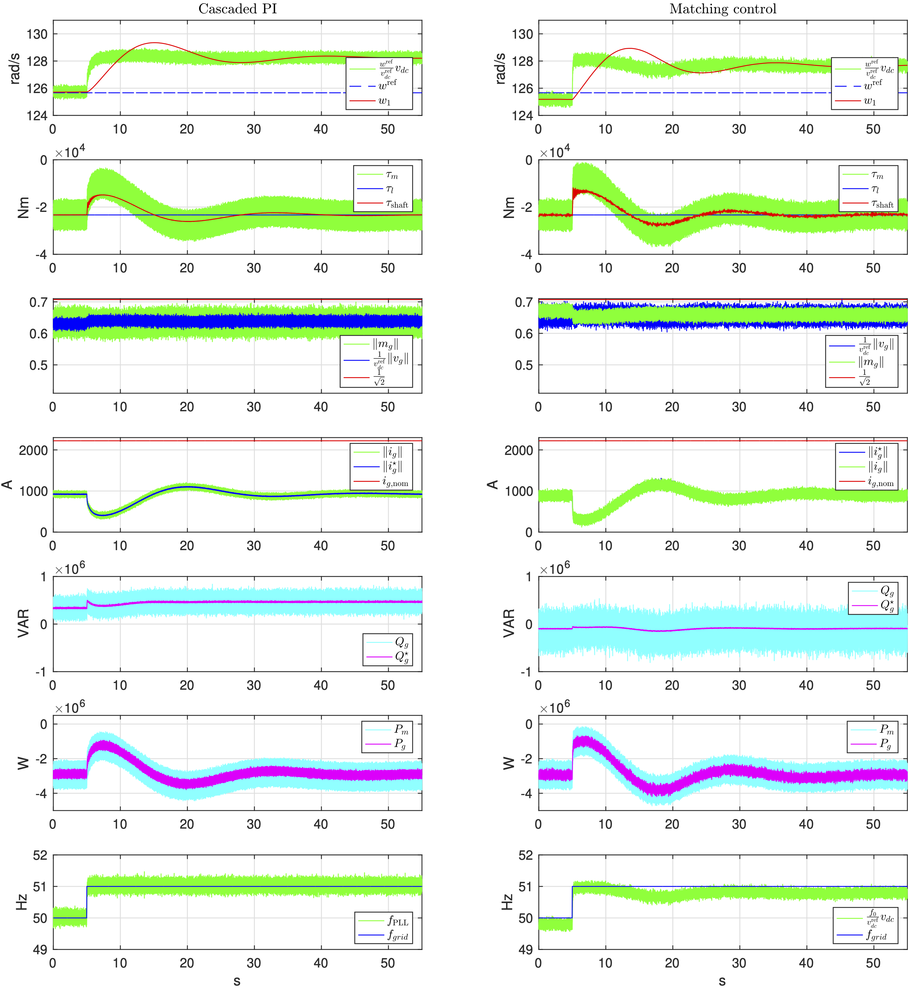  
*Fig. C2: Grid frequency step up, weak grid response. The difference here is mainly on the AC bus behavior, being more susceptible to disturbance and switching noise.*
[Download PDF](fig/Weak_freqstep_up.pdf)

 

### D. Single-phase drop test
We now set the load to $0.95p.u.$, amounting to about 5.57 MW of positive (motoring) load. We now compare side-by-side the response of the two control approaches to a drop of one phase to zero. The stiff grid case is presented in Fig. D1 and the weak grid in Fig. D2.

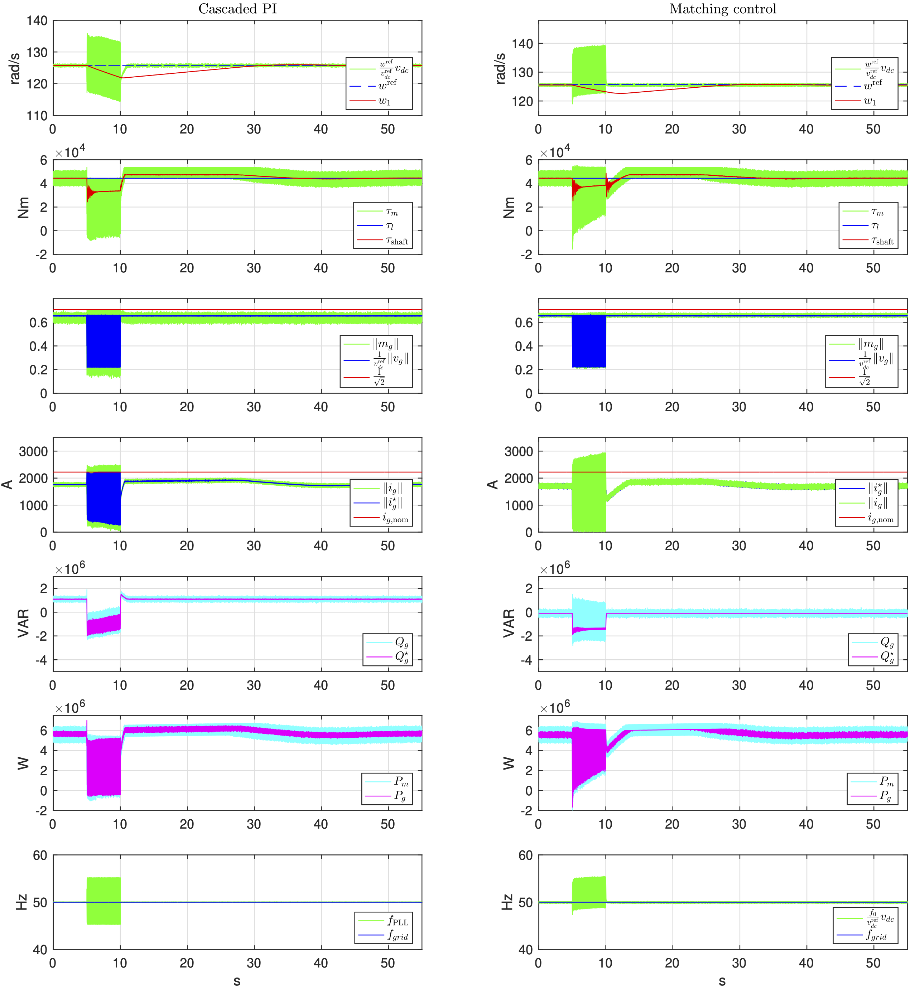
*Fig. D1: Single phase fault, stiff grid response. Due to the low impedance of the stiff grid the second harmonic of the line frequency affects the drive in similar ways for both approaches.*
[Download PDF](fig/Stiff_singlephase.pdf)

 

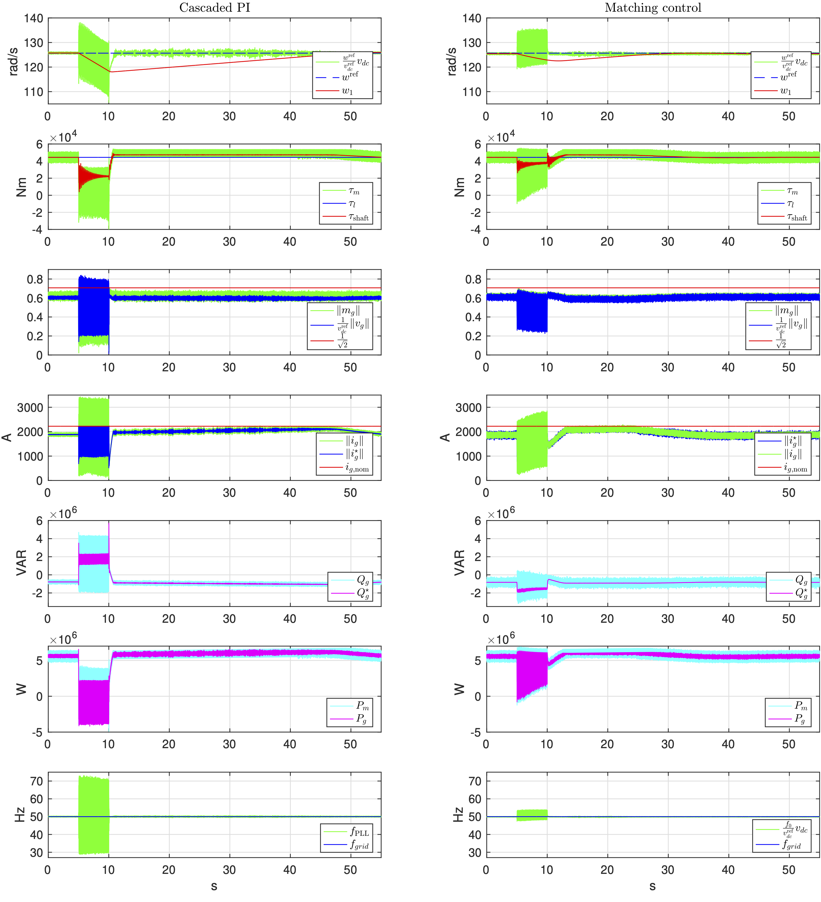  
*Fig. D2: Single phase fault, weak grid scenario. We see that the matching control has an advantage over the cascaded PI in reducing the effect of the second harmonic.*
[Download PDF](fig/Weak_singlephase.pdf)

### E. Frequency step-down test
With the load at $0.95p.u.$, we evaluate the response to a infinite bus $v_{grid}$ frequency step of $-1Hz$. The stiff and weak grid cases are presented in Fig. E1 and Fig. E2, respectively. Note that in both frequency tests, a step of $1Hz$ is an extreme case and represents a change in drivetrain power of approx. $0.02p.u.$, a difference which is seen at the end of the transient.

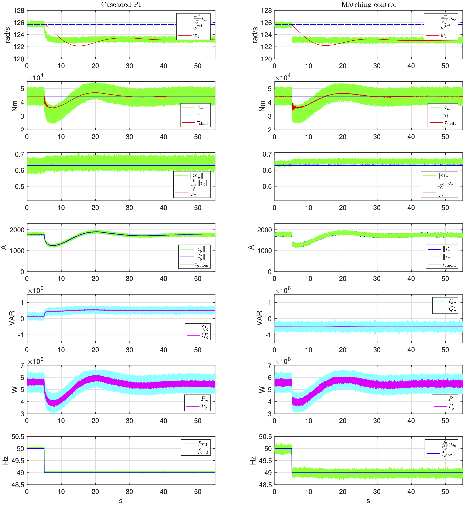
*Fig. E1: Grid frequency step down, stiff grid response. In this case we see a very similar performance between the two approaches and when compared to the frequency step-up in Fig. C2.*
[Download PDF](fig/Stiff_freqstep_down.pdf)

 

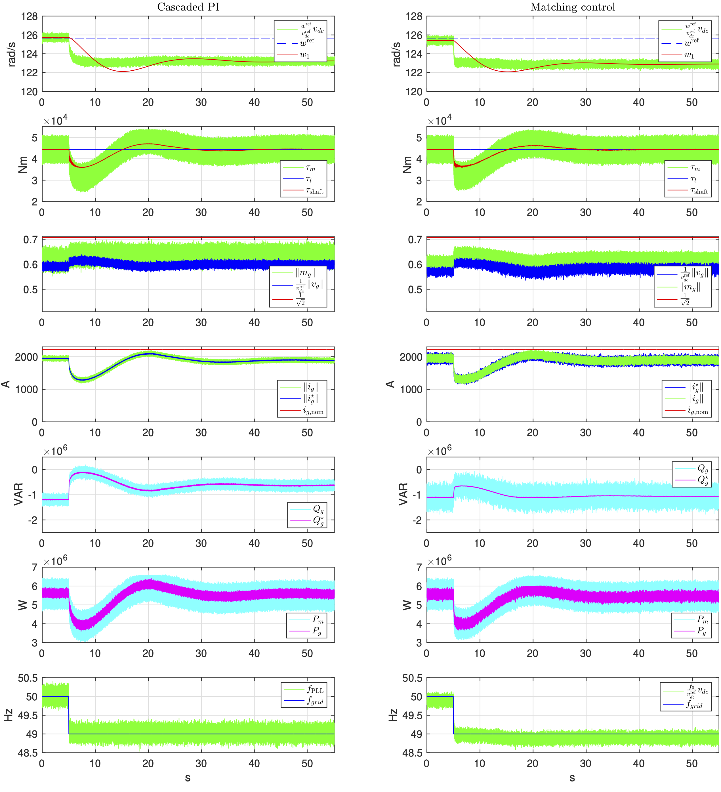  
*Fig. E2: Grid frequency step down, weak grid response. As in Fig. C2, the difference is mainly on the AC bus behavior, being more susceptible to disturbance and switching noise.*
[Download PDF](fig/Weak_freqstep_down.pdf)

### F. Voltage dip test
We now perform the test in [[2](#references)], Section VA, under similar conditions ($0.95p.u.$ load). The stiff grid case is presented in Fig. F1 and the weak grid in Fig. F2. 

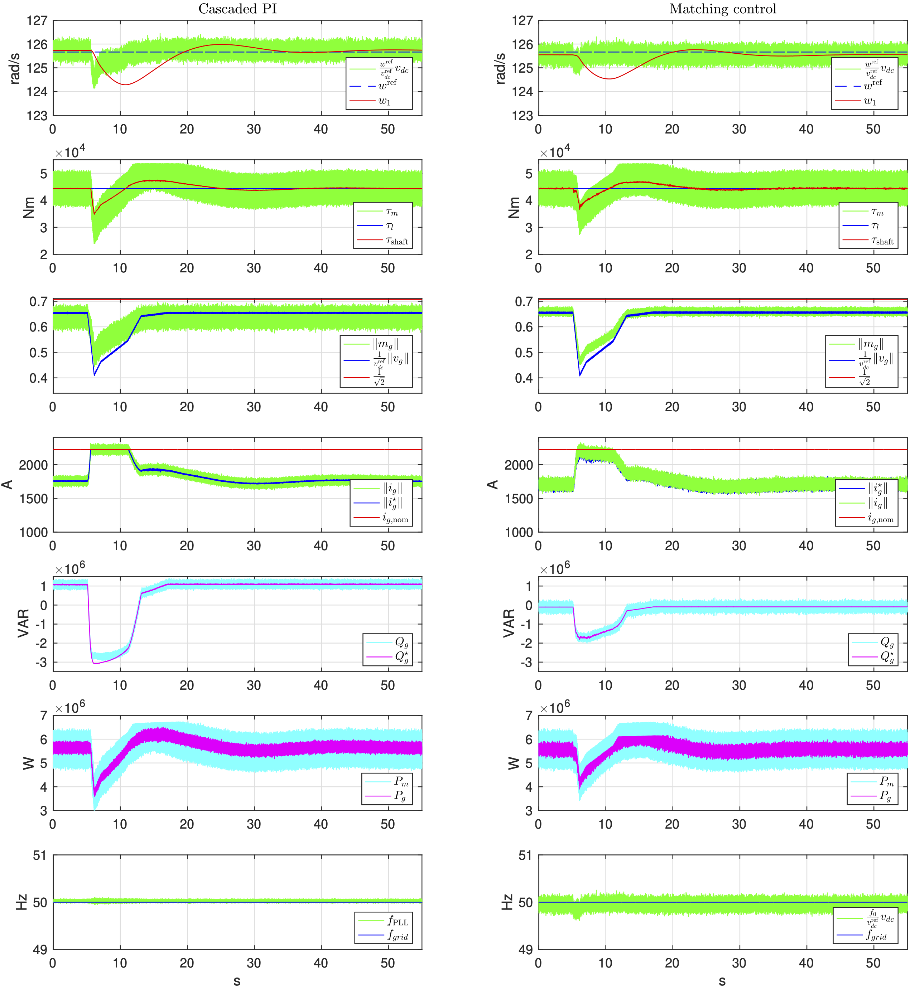
*Fig. F1: Voltage dip, stiff grid scenario. As a direct comparison to [[2](#references)], we see a similar behavior here where the current is well limited through the reactive power controller as well as the barrier function mechanism which implements the function of projection onto the constraint set.*
[Download PDF](fig/Stiff_dip_profile.pdf)

 

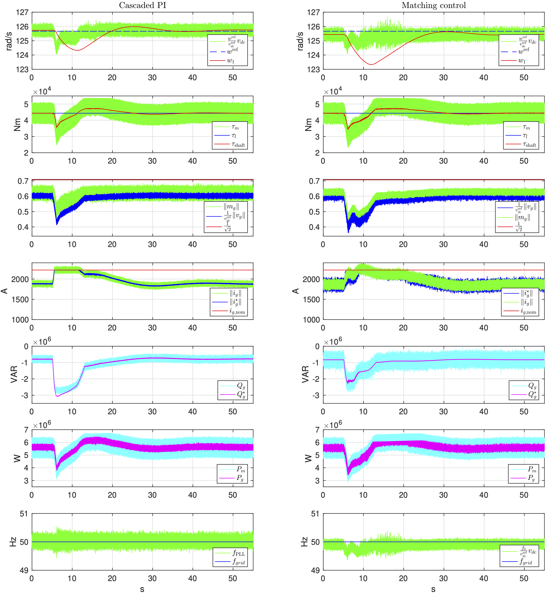  
*Fig. F2: Voltage dip, weak grid. We further how that the electronic synchronous machine behavior is different due to the different current tracking mechanism when compared to the cascaded PI.*
[Download PDF](fig/Weak_dip_profile.pdf)

### G. Load reversal test
Finally, we present a load step from $-0.5p.u.$ to $0.95p.u.$ under conditions of stiff grid in Fig. G1, and weak grid in Fig. G2.

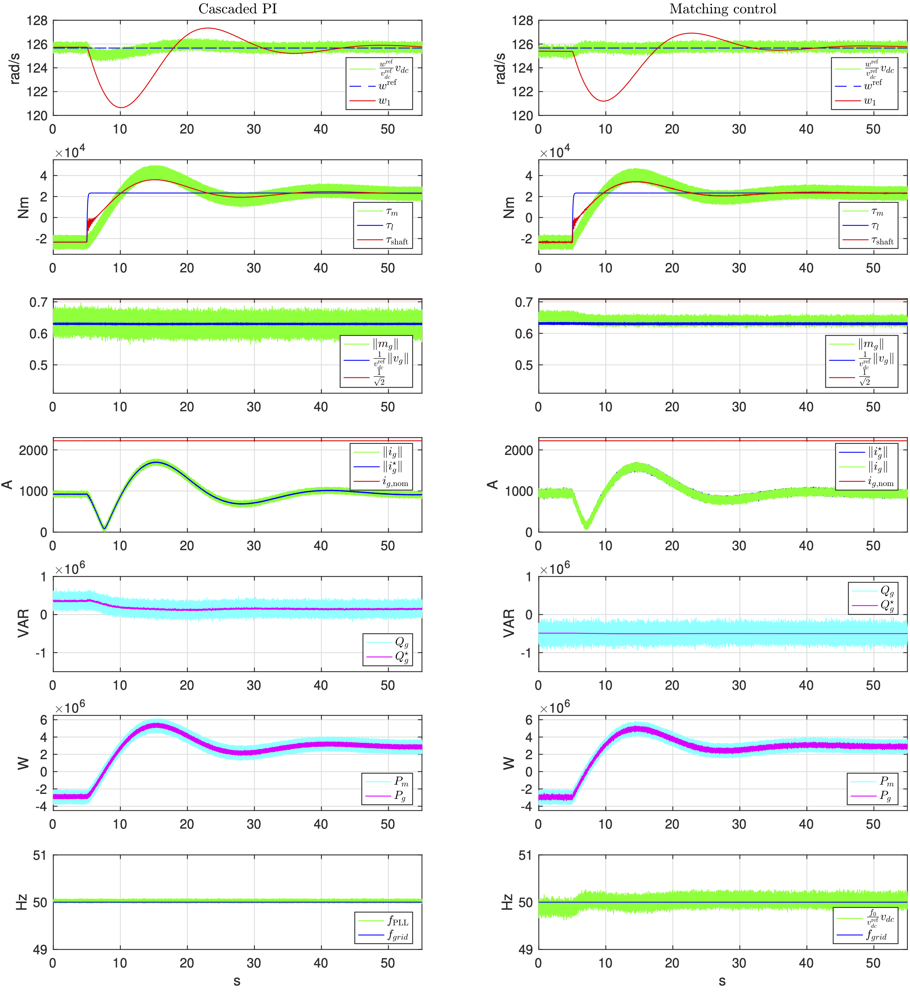
*Fig. G1: Stiff grid, load step. The two control approaches yield similar results despite the difference in design philosophy.*
[Download PDF](fig/Stiff_load_step.pdf)

 

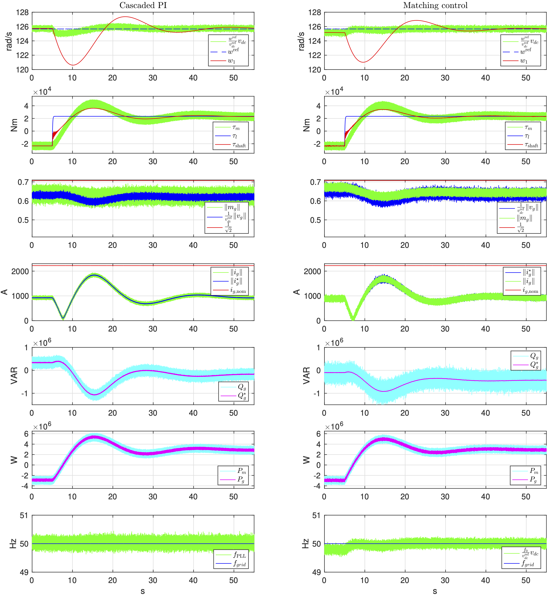  
*Fig. G2: Weak grid, load step. This test concludes the detailed comparison between the traditional cascade tracking approach and the novel, synchronous machine matching with energy-based control approach, yielding similar behavior. We see how the latter achieves current tracking, as well as modulation and current constraint satisfaction, in addition to the DC-link regulation, AC voltage support, and inertia provision features.*
[Download PDF](fig/Weak_load_step.pdf)

---

## References
[1] C. Arghir, P. Joerg, and S. Mastellone, “Transferring the driveshaft inertia to the grid via the DC-link in back-to-back drives”

[2] S. Chandrasekaran, C. Arghir, P. Joerg, F. Doerfler, and S. Mastellone, “Reactive power flow optimization in ac drive systems,” arXiv preprint [arXiv:2504.10360](https://arxiv.org/abs/2504.10360), 2025

